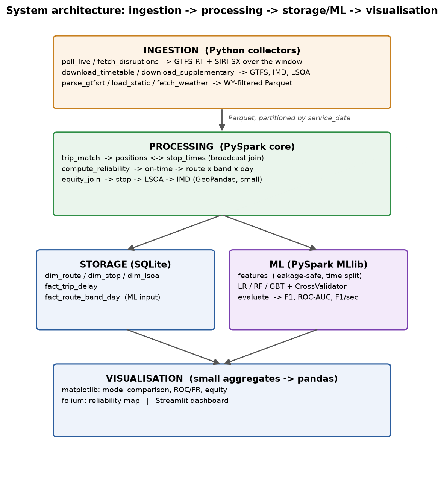
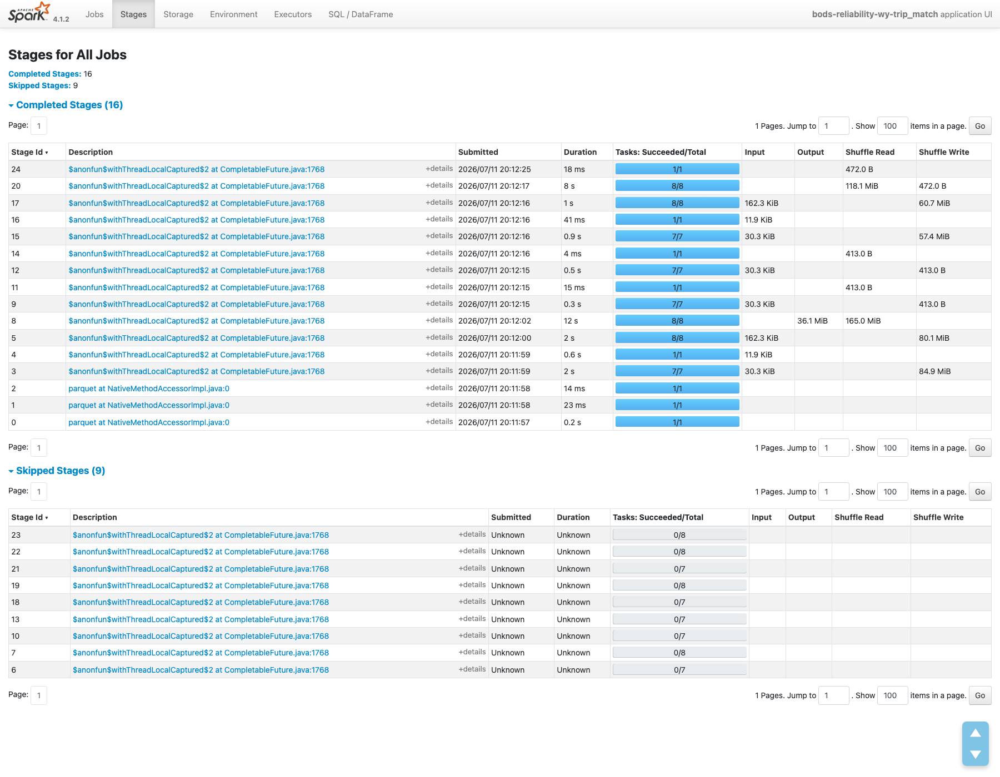
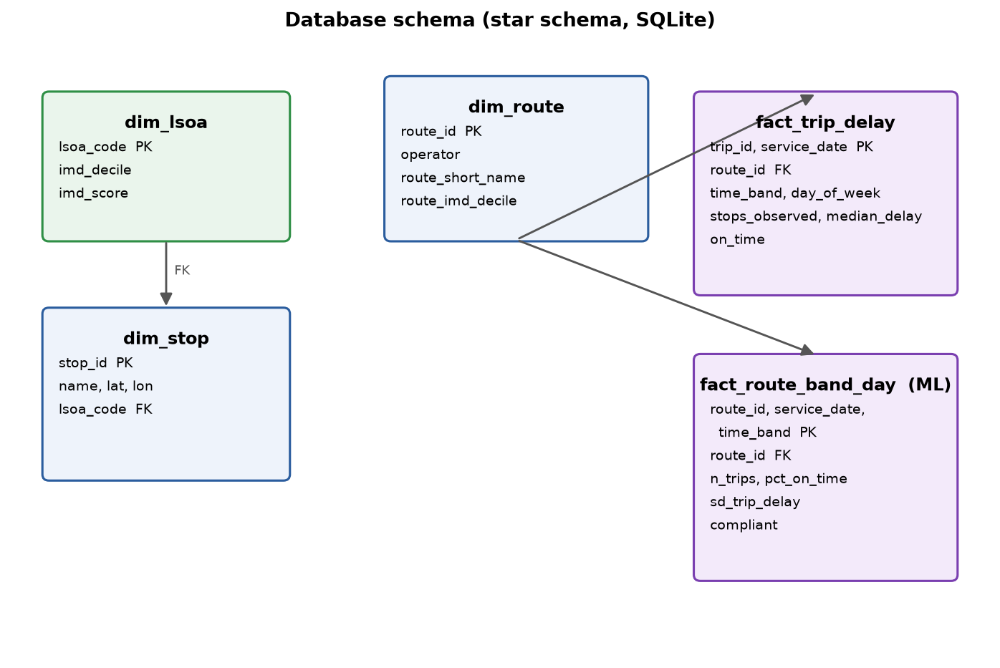

# Bus reliability and deprivation in West Yorkshire

**Module** ST5011CEM Big Data Programming Project · **Author** Bishow Dip ·
**Supervisor** Mr. Siddhartha Neupane · **Code**
https://github.com/bishowdip/BODStimetables

This is the illustrated version of the report: the same text as
`report_draft.md` with every figure placed inline. The figures are regenerated
from the measured results by the pipeline, so every number in them can be
reproduced.

## 1. Executive summary

England's bus regulator holds operators to one number: 85% of trips within two
minutes of the timetable. I wanted to know three things. Do West Yorkshire's
buses actually meet it, can I predict the routes that miss it, and do the misses
land on poorer areas. Over seven days in July 2026 I recorded where the region's
buses were, 4,933,858 GPS positions from the Bus Open Data Service, and lined
them up against 2,565,042 scheduled stop times in PySpark. Most combinations of
route, time band and day failed: only 26.8% of 9,533 cleared the bar. A random
forest then predicted the failures on two later days it had never seen, with an
F1 of 0.746. The result I did not expect was about the standard itself. It
rewards routes that run rarely. Poorer areas run the busy routes, so they miss
the target even though their buses are, if anything, slightly more punctual.

*Figure 1. The brief's six reliability and efficiency metrics on the study week.
Red marks a value below the target, green above it.*

## 2. Introduction

A single punctuality average tells a council very little. It hides the hours
when buses fail and the places where they fail. A transport authority deciding
where to send inspectors or money needs both, and that authority is the reader I
wrote this for.

The system pulls together four kinds of open data: timetables, live bus
positions, disruption notices and deprivation statistics. It computes the
reliability figures the brief defines, then trains three classifiers to flag the
route and time-band combinations likely to fail the 85% test the next day. It
runs on a laptop, with Spark handling the parts too big for memory.

I use all six metrics the brief lists. Service Reliability, the share of trips
within two minutes, is what the models predict. Headway Regularity, how evenly
spaced the buses are, and Travel Time Variability, how much journey times
wander, I report per route. Service Efficiency I report as the share of
scheduled trips that left any live trace. Algorithmic Efficiency comes from
stage timings and the Spark UI, and Model Efficiency from F1 per second of
training.

The work covers learning outcomes B1 (I analyse the cost of the matching join),
B2 (a working multi-stage system), B4 (large data and machine learning), B6
(Git, safe SQL, an ethics section), B7 (this report and the viva) and B8 (the
deprivation analysis).

## 3. Related work

Furth and Muller (2006) argued that AVL data should change how we measure
reliability, because what costs passengers is the extra time they budget for an
unreliable bus, not the average wait. Daganzo (2009) treats bunching as an
instability: let headways drift and they collapse into pairs, which is why
spacing deserves a metric of its own separate from lateness. Lucas (2012) sets
out the evidence that poor transport tracks poverty. Robinson (1950) is the
reason I keep every claim at area level and never read anything about a person
from an LSOA average.

## 4. Data collection and preprocessing

I used six sources, all real and all open. Three come from BODS: the Yorkshire
timetable as a 109 MB GTFS zip, the live position feed, and the disruption feed.
The Indices of Deprivation 2019 give each small area, an LSOA, a deprivation
decile. ONS boundaries place the 1,767 West Yorkshire LSOAs on the map.
Open-Meteo gives hourly weather and needs no key.

*Figure 2. The six sources and how each was collected. The two live feeds (blue
rows) are polled over the window; the rest are single downloads.*

The positions were the awkward part. BODS only serves them live, so there is
nothing to download after the fact. I polled the feed every 60 seconds for a
week (2 to 8 July 2026), asked BODS to return only the West Yorkshire box, and
saved 10,546 protobuf snapshots. That is 97.5% of the maximum possible; the one
real gap is about three hours on the Sunday.

Parsing the snapshots gave 11.4 million pings. Buses report on their own clock,
slower than my once-a-minute poll, so more than half the pings were the same
report seen twice. Dropping duplicates on vehicle and timestamp left 4,933,858
genuine positions, and 97.5% of them name the trip they belong to. Two other
cleaning steps mattered. A bus scheduled for 24:05 and seen at 00:10 is five
minutes late, not almost a day early, so I wrap times across midnight. And about
1.17% of matched events showed delays over an hour; those are GPS jumps rather
than buses, so they go.

Added up, the sources hold more than seven million records, about seventy times
the 100,000 the brief asks for, reached with real data from several catalogues
and several days plus the supplementary sets. The three-month window the brief
mentions is a fallback for datasets that fall short of 100,000; mine does not,
and a live-only feed has no three months of history to fetch anyway. I used no
synthetic data.

*Figure 3. Volumes through the pipeline, from 11.4 million raw pings down to the
9,533 route-band-day rows the models use (log scale).*

## 5. Methodology

Matching is the core step. For each position I take its trip and service day,
find that trip's scheduled stops, and measure the straight-line distance to each
one. The nearest ping within 50 metres of a stop, for that trip and day, gives
the time the bus passed it; subtract the scheduled time and that is the delay.
This produced 1,698,693 matched stop events over 34,077 distinct trips.
Broadcasting the small stops table keeps the join near O(P log S) instead of
comparing every ping to every stop; the full cost table is in
`docs/architecture.md`.

A trip is on time when its median stop delay sits inside two minutes. I use the
median because one bad GPS fix should not sink a whole trip. Trips roll up to
route, time band and day, and a combination is compliant when at least 85% of
its trips ran on time. That leaves 9,533 rows, 26.8% of them compliant, which is
the imbalance the models have to handle.

Every feature is something you could know before the bus sets off: the day, the
time band, whether it is a weekend, the number of stops, how many trips run in
the band, the scheduled spacing, the weather, the route's deprivation decile,
any active disruption, and the route's own past punctuality. That last one is
the dangerous feature, so I compute it from the training days only, and a test
recomputes it from scratch and checks the two agree to six decimal places.

The split follows the calendar, not chance, because the job is to predict a
future day. I train on 2 to 6 July and test on 7 and 8 July, dates the model
does not touch until the end. A random cross-validation fold would leak Friday's
patterns into Monday's prediction. Inside the training block I use 3-fold
cross-validation to tune logistic regression, a random forest and
gradient-boosted trees.

## 6. System design and implementation

The code is four layers, and Parquet files sit between them so any stage can run
on its own. Python collectors poll the live feeds. Spark does everything from the
parsed positions onward. SQLite holds the finished tables in a star schema. Only
the small final tables reach pandas and matplotlib. The one place I step out of
Spark on purpose is the stop-to-area join: 16,139 stops is small, so GeoPandas is
the simpler tool and I say why.

*Figure 4. The four layers. Parquet partitioned by service date is the hand-off
between every stage.*

The Spark evidence is concrete. I set eight shuffle partitions. Broadcasting the
stops table cut the matching join from 8.98 to 4.37 seconds, a bit over twice as
fast, with the same 2,602,507 rows out either way. The matched table is cached
once and feeds three separate aggregations.

*Figure 5. The Spark UI during the real join: eight tasks to a stage, shuffle
reads up to 165 MiB, and nine skipped stages where Spark reused earlier output
instead of recomputing it.*

Security follows the brief. Every query uses placeholders, so there is no
injection surface. The only secret, the BODS key, sits in a `.env` file that Git
ignores. On an 8 GB laptop the memory point writes itself: a national week of
positions will not fit in pandas, so the parser reads one snapshot at a time and
Spark spills to disk past that.

*Figure 6. The SQLite star schema: route, stop and LSOA dimensions around the
trip-level and route-band-day fact tables, with a disruption bridge.*

## 7. Results and evaluation

Half of matched stop events (50.3%) fell inside two minutes. The median delay
was about a minute late, with a long tail to the right: a tenth of stops were
more than seven minutes down. At the standard's own grain, 26.8% of
route-band-days passed. Loosening the window lifts that smoothly, to 44.2% at
three minutes and 68.3% at five, so the headline is not a trick of the
two-minute line.

*Figure 7. Delay at every matched stop event. The distribution leans late: the
median is about a minute behind schedule and the tail runs well past the on-time
band, which is why only half of stop events sit inside it.*

*Figure 8. Compliance under the two, three and five minute windows. The gradient
is smooth, so the finding does not hang on one threshold.*

The other metrics agree. Only 7.8% of band-days keep their spacing within a
fifth of schedule, and only 13.6% of routes hold journey-time variation under
15%. The AVL-confirmed floor is 79.1% of the week's 100,100 scheduled trips,
lower on the gap-affected Sunday. I call it a floor deliberately: a trip with no
live trace might have run silently, so I cannot record it as a cancellation.

*Figure 9. Share of scheduled trips that left a live trace, by day, against the
weekly floor of 79.1%. Sunday's dip includes the three-hour capture gap.*

On the two unseen days the random forest did best, with 0.769 accuracy, 0.746
F1, 0.763 ROC-AUC and 0.534 PR-AUC, against a 0.730 majority baseline on a 27%
positive rate. Gradient boosting won cross-validation at 0.816 AUC but slipped to
0.753 on the held-out days, a small case of overfitting worth reporting. Logistic
regression was quickest and takes the F1-per-second measure.

*Figure 10. The three classifiers on the held-out future days.*

*Figure 11. ROC and precision-recall curves. A PR-AUC of 0.53 is about twice the
0.27 base rate, so the models carry real signal on the minority class.*

The forest leans hardest on a route's own history, then on how many trips run in
the band. Sweeping the decision threshold, the compliant-class F1 peaks at 0.30
rather than 0.5, which is the dial a regulator would actually turn.

*Figure 12. Feature importance. Route history leads; trips-per-band is second,
which matters for the deprivation finding below.*

*Figure 13. Precision, recall and F1 for the compliant class across decision
thresholds. F1 peaks at 0.30.*

The deprivation result is where it gets interesting, because the two ways of
measuring it disagree. Threshold compliance is a little higher in richer areas
(rho +0.093, permutation p = 0.033, 522 routes). Raw punctuality runs the other
way, with buses in poorer areas more often on time (rho -0.227, p < 0.001).

*Figure 14. The same x-axis, opposite stories: compliance rises with affluence
(left), while the raw on-time rate falls with it (right).*

The reason is the metric. Bands with one or two trips pass the 85% bar 46% of
the time; bands with twenty or more pass 7% of the time, and frequency has
almost no link to actual punctuality (rho -0.007). Poorer areas run the frequent
services (rho -0.216), so the bar marks them down for being busy. The random
forest picking trips-per-band as its second feature says the same thing another
way. The recommendation for a regulator is plain: split the standard by
frequency before enforcing it.

*Figure 15. The core finding. As scheduled trips per band rise, the share of
compliant band-days falls from 46% to 7% (bars), yet the mean on-time rate of
the trips barely moves (line). The threshold measures frequency, not punctuality.*

*Figure 16. Share of route-band-days meeting the 85% bar by IMD decile
(1 = most deprived).*

*Figure 17. 12,393 stops coloured by measured on-time rate (green at or above
85%, orange 60 to 85%, red below 60%). Red dominates, matching the 26.8%
headline; the interactive version is `figures/reliability_map.html`.*

## 8. Critical reflection

The AVL floor is the biggest caveat. A fifth of scheduled trips left no trace,
and I cannot tell a cancelled bus from a quiet one. The 60-second poll blurs each
passing time by up to a minute. About 2.5% of pings name no trip and go
unmatched. Every deprivation claim stays at area level (Robinson 1950); none of
it says anything about a person. The data is operational and open, not personal,
but a vehicle's trace could in principle profile its driver, so I keep everything
at trip level or above. There is an ethics point in the finding too: enforce a
frequency-biased bar without thinking and you penalise the operators serving the
busiest, poorest routes. The memory limit shaped the design rather than
decorating it.

## 9. Conclusion

The project does what it set out to. It runs from live national feeds to a tested
deprivation result, compares three models honestly, and backs every optimisation
claim with a number. The finding I would defend hardest is the methodological
one. West Yorkshire's buses do broadly miss the 85% standard, but the standard
measures how often a route runs almost as much as how punctual it is. Next I
would capture a longer window, handle the calendar's exception dates, and add a
spatial fallback for the pings with no trip id.

## References

Daganzo, C.F. (2009) 'A headway-based approach to eliminate bus bunching:
systematic analysis and comparisons', *Transportation Research Part B:
Methodological*, 43(10), pp. 913-921. doi:10.1016/j.trb.2009.04.002.

Furth, P.G. and Muller, T.H.J. (2006) 'Service reliability and hidden waiting
time: insights from automatic vehicle location data', *Transportation Research
Record*, 1955(1), pp. 79-87. doi:10.1177/0361198106195500110.

Lucas, K. (2012) 'Transport and social exclusion: where are we now?', *Transport
Policy*, 20, pp. 105-113. doi:10.1016/j.tranpol.2012.01.013.

Robinson, W.S. (1950) 'Ecological correlations and the behavior of individuals',
*American Sociological Review*, 15(3), pp. 351-357. doi:10.2307/2087176.

Data sources: Department for Transport, Bus Open Data Service, Open Government
Licence v3.0; Ministry of Housing, Communities and Local Government, English
Indices of Deprivation 2019; Office for National Statistics, LSOA 2011
boundaries; Open-Meteo historical weather API. All accessed July 2026.
